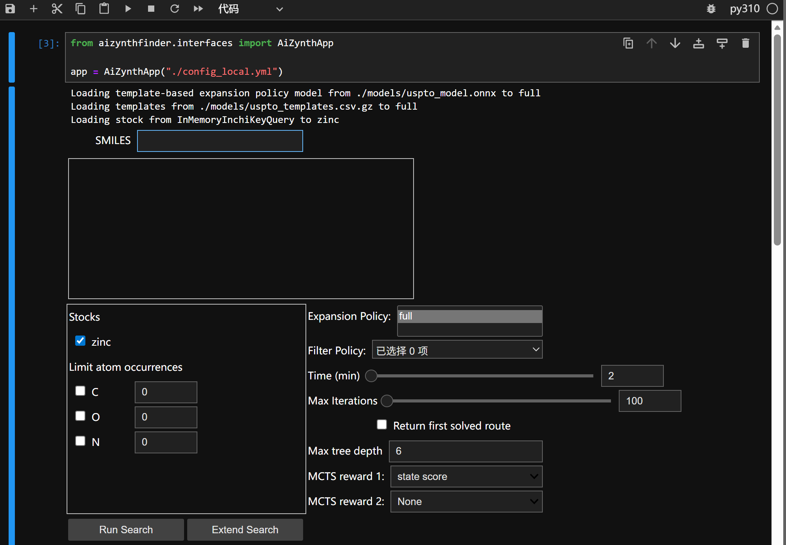

# AiZynthFinder 逆合成预测

原项目：https://github.com/MolecularAI/aizynthfinder
本项目对原项目解决了一些运行环境的bug，补充了一些必要文件，针对国内网络环境无法下载模型的问题做了优化，改编者为`LHH90538`

## 快速安装

1.克隆项目代码
```
git clone https://github.com/LHH90538/aizynthfinder.git
```

2.创建虚拟环境

```
conda create -n py310 python=3.10 -y
conda init
```

3.新开一个终端，激活虚拟环境
```
conda activate py310
```

4.安装程序

```
pip install poetry==1.4.0
poetry install --all-extras
```

5.下载模型
国内环境远程下载模型网络容易断，所以建议手动下载模型(如果打不开这个figshare网址，可能要科学上网)

在aizynthfinder/文件夹里新建一个`model`文件夹用于放置模型
```
cd aizynthfinder/
mkdir models
```
请手动下载以下 3 个模型文件：

- `zinc_stock_17_04_20.hdf5`（632.51MB）  
  下载地址：<https://figshare.com/articles/dataset/AiZynthFinder_a_fast_robust_and_flexible_open-source_software_for_retrosynthetic_planning/12334577>

- `uspto_unique_templates.csv.gz`（3.3MB）  
  下载地址：<https://zenodo.org/records/7341155>


- `uspto_model.onnx`（91.5MB）  
  下载地址：<https://zenodo.org/records/7797465>

把这三个模型放在刚刚新建的`model`文件夹里(无需解压)

6.布置jupyter notebook界面注册内核
在终端运行
```
pip install ipykernel
python -m ipykernel install --user --name py310 --display-name "py310"
```

刷新后在`test.ipynb`文件中，右上角选择py310内核
然后运行命令即可,出现如下界面即成功部署！
